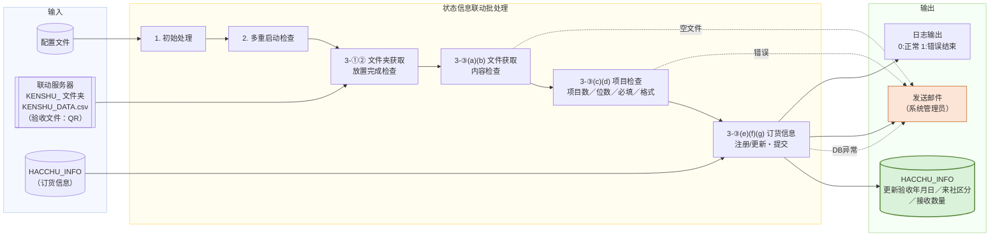

# temp
This is a shared directory

入出力概要図

```mermaid
flowchart LR
  subgraph IN["输入"]
    CONF[("配置文件")]
    SRV[["联动服务器<br/>KENSHU_ 文件夹<br/>KENSHU_DATA.csv<br/>（验收文件：QR）"]]
    DB_IN[("HACCHU_INFO<br/>（订货信息）")]
  end

  subgraph BATCH["状态信息联动批处理"]
    direction TB
    T1["1. 初始处理"]
    T2["2. 多重启动检查"]
    T3["3-①② 文件夹获取<br/>放置完成检查"]
    T4["3-③(a)(b) 文件获取<br/>内容检查"]
    T5["3-③(c)(d) 项目检查<br/>项目数／位数／必填／格式"]
    T6["3-③(e)(f)(g) 订货信息<br/>注册/更新・提交"]
    T1 --> T2 --> T3 --> T4 --> T5 --> T6
  end

  subgraph OUT["输出"]
    DB_OUT[("HACCHU_INFO<br/>更新验收年月日／来社区分<br/>／接收数量")]
    MAIL["发送邮件<br/>（系统管理员）"]
    LOG["日志输出<br/>0:正常 1:错误结束"]
  end

  CONF --> T1
  SRV --> T3
  DB_IN --> T6
  T5 -.->|"错误"| MAIL
  T6 --> DB_OUT
  T6 -.->|"DB异常"| MAIL
  T4 -.->|"空文件"| MAIL
  T6 --> MAIL
  T6 --> LOG

  style IN fill:#f5f9ff,stroke:#b4c6e7
  style OUT fill:#f5fff5,stroke:#a9d08e
  style BATCH fill:#fffdf0,stroke:#ffd966
  style DB_OUT fill:#d9f2d9,stroke:#548235,stroke-width:2px
  style MAIL fill:#fce4d6,stroke:#c55a11
```

---

## 更新項目の対応（テーブル設計書との整合）
